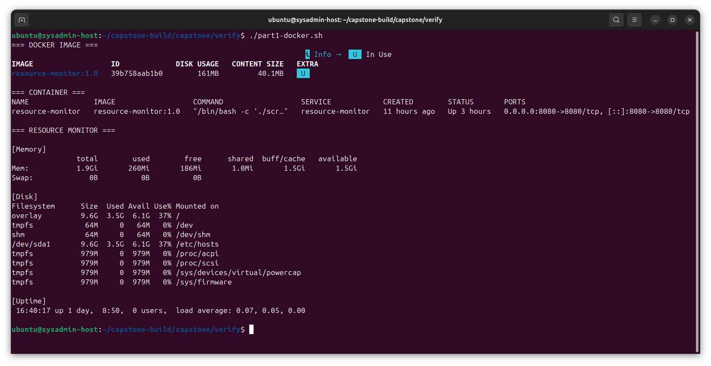
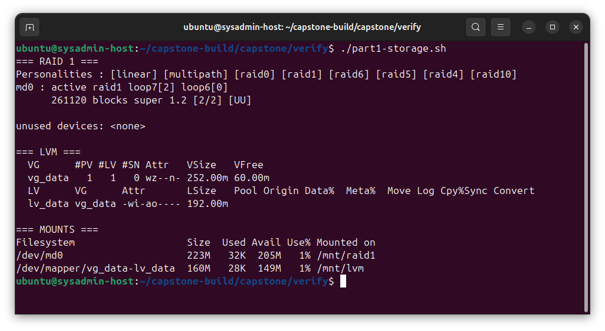
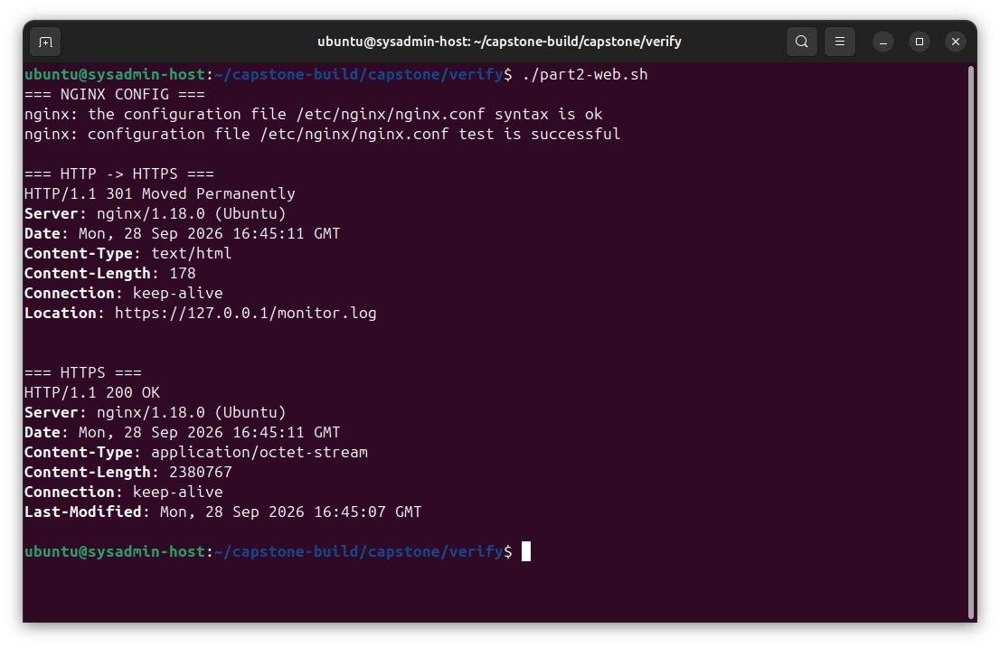
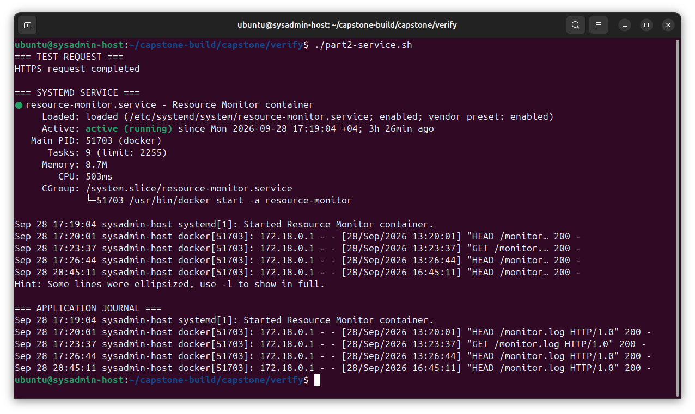

## Capstone

Итоговый проект курса «Системное администрирование».

Проект развивает скрипт мониторинга ресурсов из модуля 2: скрипт упаковывается в Docker-контейнер, а затем
разворачивается как HTTP-сервис за Nginx с TLS и управлением через systemd.

### Контейнеризация

Сборка образа из корня репозитория:

```bash
docker build -t resource-monitor:1.0 -f capstone/Dockerfile .
```

Создание и запуск контейнера через Docker Compose:

```bash
docker compose -f capstone/compose.yaml up -d --build
```

Проверка:

```bash
docker compose -f capstone/compose.yaml ps
docker exec resource-monitor tail -20 /var/www/monitor.log
curl http://127.0.0.1:8080/monitor.log
```

Контейнер публикует HTTP-сервис на порту `8080`.

### Хранилище

Для практики с блочными устройствами используются три файла, подключенные как loop-устройства.

На двух устройствах создан RAID 1:

```text
disk1.img -> loop device --\
                            +--> RAID 1 --> ext4 --> /mnt/raid1
disk2.img -> loop device --/
```

Работа массива проверена в деградированном состоянии с последующим восстановлением второго участника.

На третьем устройстве создан LVM:

```text
disk3.img
    |
    v
loop device
    |
    v
PV -> vg_data -> lv_data -> ext4 -> /mnt/lvm
```

Логический том был расширен с 128 MiB до 192 MiB с последующим online-расширением файловой системы ext4.

### Reverse proxy и TLS

Nginx используется как reverse proxy перед контейнером:

```text
Client
   |
 HTTPS :443
   |
 Nginx
   |
 HTTP :8080
   |
 Docker container
   |
 Python HTTP server
```

HTTP-запросы на порт `80` перенаправляются на HTTPS. Для учебного окружения используется self-signed TLS-сертификат.

Конфигурация Nginx находится в:

```text
capstone/nginx/my-app.conf
```

Проверка конфигурации:

```bash
sudo nginx -t
```

Проверка перенаправления HTTP на HTTPS:

```bash
curl -I http://127.0.0.1/monitor.log
```

Проверка HTTPS:

```bash
curl -kI https://127.0.0.1/monitor.log
```

### Управление сервисом

Контейнер управляется через systemd unit:

```text
capstone/systemd/resource-monitor.service
```

После установки unit-файла:

```bash
sudo systemctl daemon-reload
sudo systemctl enable resource-monitor
sudo systemctl start resource-monitor
```

Проверка состояния:

```bash
systemctl status resource-monitor
```

Для дальнейшего управления сервисом используются:

```bash
sudo systemctl start resource-monitor
sudo systemctl stop resource-monitor
sudo systemctl restart resource-monitor
```

### Наблюдаемость

События приложения доступны через systemd journal:

```bash
sudo journalctl -u resource-monitor
```

Запросы и ошибки reverse proxy записываются в стандартные логи Nginx:

```bash
sudo tail -f /var/log/nginx/access.log
sudo tail -f /var/log/nginx/error.log
```

### Результаты проверки

#### Docker и мониторинг



#### RAID и LVM



#### Nginx и TLS



#### systemd и журнал


